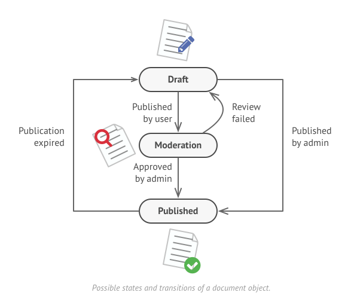
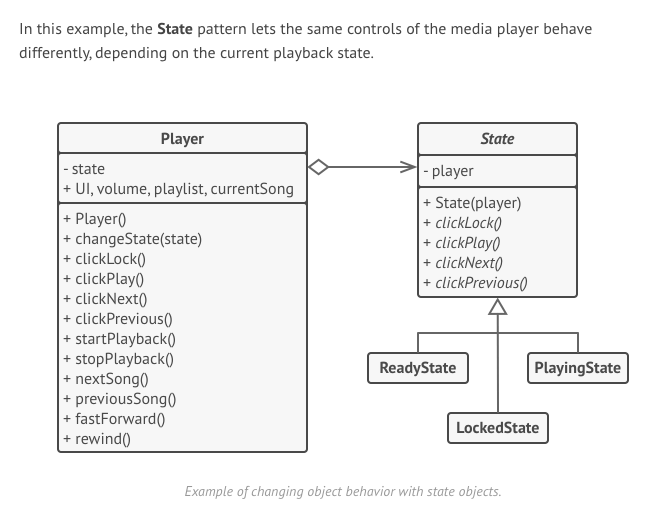

# 状态模式
## 1. 架构解决什么问题？
* 合适的时机合适的代码结构
## 2. 控制反转(Inversion of Control)
* 系统行为 -> 控制流 -> 源代码依赖关系
* 概念
* 高层次不依赖于低层次，共同依赖于抽象
* 抽象不依赖具体，具体依赖于抽象
* 面向接口编程，而非面向实现编程
* 具体示例
	* Player
	* App
	* Service
* 实现方式
	* 依赖注入
  	* Service
  	* App
	* 依赖查找
## 3. 状态模式
   1. 定义： 状态模式(State)允许一个对象在其内部状态改变的时候改变它的行为，对象看起来似乎修改了它的类。
   2. 解读： 我们以逗号分割，把这句话分为两部分来看。第一部分的意思是将状态封装成独立的类，并 将请求委托给当前的状态对象，当对象的内部状态改变时，会带来不同的行为变化。电灯的例子 足以说明这一点，在 off 和 on 这两种不同的状态下，我们点击同一个按钮，得到的行为反馈是截 然不同的。第二部分是从客户的角度来看，我们使用的对象，在不同的状态下具有截然不同的行为，这 个对象看起来是从不同的类中实例化而来的，实际上这是使用了委托的效果。
   3. 前提
      * 状态多 ( >2 )
      * 状态切换的动作重 ( >3 )
      * 状态之间互相转化频繁
      * 可用有限状态机描述
   4. 例子
      1. Light
      2. upload 
      3. Document 
      4. 手机在不同场景下，home键响应
         1. lock -> unlock
         2. list -> back to home
         3. in application -> quit
      5. Player 
   5. 实际应用场景
      1. [设计模式在美团外卖营销业务中的应用](https://tech.meituan.com/2020/03/19/design-pattern-practice-in-marketing.html)
      2. 备案
   6. 如何实施
      1. Context是谁
      2. State有哪些
      3. 有哪些行为
      4. context 与 state关联
   7. 优缺点
      1. 优点
				 * 单一职责
				 * 开闭原则
				 * 提升代码可读性
      2. 缺点
         * 状态膨胀
         * 如果状态少或者切换不频繁，过渡设计
   8. 与策略模式区别
## 4. 有限状态机
1. 初始值、状态、流转、流转控制
2. 举个栗子🌰
## 5. 小结
* 控制反转非常重要，面向接口编程，而非面向实现编程
* 状态模式使用前提，状态多，切换频繁且重
* 不要overkill
* 有限状态机可以帮助我们更好地管理状态的流转
## 5. refs
1. [推荐一个有趣的网站，方便学习设计模式](https://refactoring.guru/design-patterns/state/typescript/example)
2. [设计模式在美团外卖营销业务中的应用](https://tech.meituan.com/2020/03/19/design-pattern-practice-in-marketing.html)
3. JavaScript设计模式与开发实践.pdf
4. [javascript-state-machine](https://github.com/jakesgordon/javascript-state-machine)
